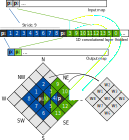

Keras layers
============

The building block of any Neural Network (NN) is the
*layer*. NNhealpix provides a number of layers that implement
commonly-used NN operations on HEALPix maps:

* :func:`nnhealpix.layers.ConvNeighbours` (convolution);
* :func:`nnhealpix.layers.DegradeAndConvNeighbours` (degrading and convolution);
* :func:`nnhealpix.layers.AveragePooling` (average pooling);
* :func:`nnhealpix.layers.MaxPooling` (max pooling);
* :func:`nnhealpix.layers.Pooling` (pooling with custom function).

These layers can be intertwined with Keras layers, as in the following
example::

  # Build a simple classification NN
  import keras
  import nnhealpix.layers

  # Take NSIDE=32 maps as input, and go through NSIDE=8 maps
  NSIDE_INPUT = 32
  NSIDE_OUTPUT = 8
  
  inputs = keras.layers.Input(shape)
  
  x = nnhealpix.layers.ConvNeighbours(NSIDE_INPUT, filters=32, kernel_size=9)(inputs)
  x = keras.layers.Activation('relu')(x)
  x = nnhealpix.layers.MaxPooling(NSIDE_INPUT, NSIDE_OUTPUT)(x)
  x = keras.layers.Dropout(0.2)(x)
  x = keras.layers.Flatten()(x)
  x = keras.layers.Dense(128)(x)
  x = keras.layers.Activation('relu')(x)
  x = keras.layers.Dense(num_classes)(x)
  out = keras.layers.Activation('softmax')(x)
  
  model = keras.models.Model(inputs=inputs, outputs=out)
  model.compile(loss=keras.losses.mse, optimizer='adam', metrics=['accuracy'])

Convolutional layer
-------------------

Convolutional layers are the most innovative idea in NNhealpix, and we
take some time to explain how they work in detail. Image
:ref:`convolution outline` depicts the algorithm. The convolution is
implemented by :func:`nnhealpix.layers.ConvNeighbours`, which
internally uses a 1D convolution on a vector containing the «unrolled»
pixels in the input map. Weights are applied to the pixels in the
unrolled vector. The layer uses a stride of 9 elements, in order to
process every pixel in the input map just once.

               
            How convolution works.

  
Module contents
---------------

.. automodule:: nnhealpix.layers
    :members:
    :undoc-members:
    :show-inheritance:
