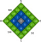

General-purpose functions
=========================

This page describes a few general-purpose functions defined by
NNhealpix. They can be grouped in the following categories:

* Access to cache files
* Computation of neighbour pixel indexes

Cache files
-----------

To speed up the computation, NNhealpix saves those intermediate
results of computation that are likely to be reused over and over
again. These files are saved in the path specified by
:data:`nnhealpix.DATADIR`. Currently the following information is
saved in cache files, once it is computed:

#. Indexes used to downgrade a map from ``nside_input`` to
   ``nside_output``, used by
   :func:`nnhealpix.layers.DegradeAndConvNeighbours`, and by
   :func:`nnhealpix.layers.Pooling` and similar layers (the name of
   the cache file can be retrieved using the function
   :func:`nnhealpix.dgrade_file_name`);
#. Indexes used to convolve a map with resolution ``nside``, used by
   :func:`nnhealpix.layers.ConvNeighbours` (the file name is
   determined by :func:`nnhealpix.filter_file_name`);

Neighbour pixel indexes
-----------------------

At the hearth of the library, a few functions compute the index of
neighbour pixels in order to implement convolution. The following
functions are used as building blocks for the layer
:func:`nnhealpix.layers.ConvNeighbours`:

#. :func:`nnhealpix.pixel_1st_neighbour` takes as input a pixel index,
   and it returns a list of 9 pixels: the first one is the index of
   the input pixel, and the following 8 are the indexes of its first
   neighbours.
#. :func:`nnhealpix.pixel_2nd_neighbour` takes as input a pixel index,
   and it returns a list of 25 pixels. The first element is again the
   input pixel index, and the other pixels are its second-order
   neighbours. (This function is still under development.)

The ordering of the pixels follows a fixed pattern, defined by the
North/East/South/West directions, as shown in figure.

               
            Order of the pixels returned by
            :func:`nnhealpix.pixel_1st_neighbour` (blue background)
            and :func:`nnhealpix.pixel_2nd_neighbour` (blue+green
            backgrounds).
   
Module contents
---------------

.. automodule:: nnhealpix
    :members:
    :undoc-members:
    :show-inheritance:
