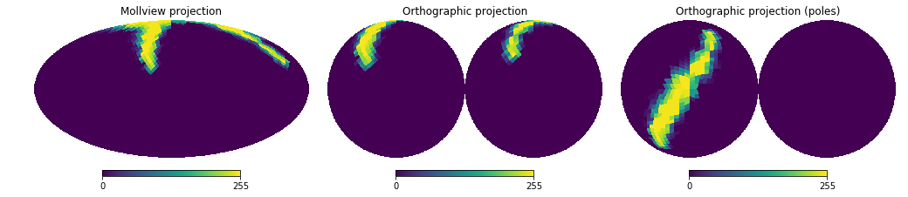
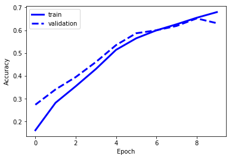
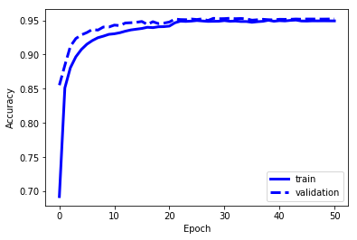
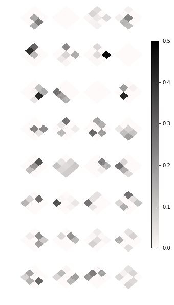
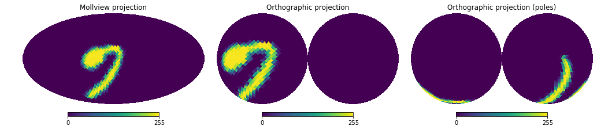
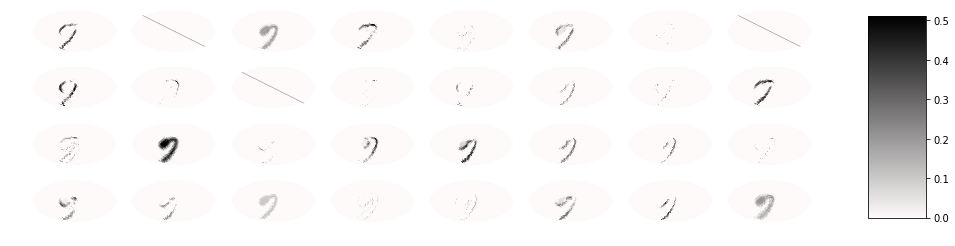

Tutorial
========

Welcome to NNHealpix documentation! In this tutorial, we show how to
use the library to perform a classification exercise. We are going to
project handwritten digits on a sphere, and we will build a simple
Convolutional Neural Network (CNN) to recognize digits. We will use
Keras and the MNIST dataset.

Build training and validation sets
----------------------------------

We are going to use the MNIST database to build our training and
validation sets. MINST is a set of 28×28 grayscale images representing
handwritten digits, and it is a widely-used database for
classification problems in Machine Learning. The MNIST dataset is
available in Keras, so we simply load it:

.. code:: ipython3

    import keras
    from keras.datasets import mnist
    from keras import backend as K
    K.set_image_dim_ordering("th")

    (X_train_2d, y_train), (X_val_2d, y_val) = mnist.load_data()

As we are going to randomly rotate the digits while projecting them on
the sphere, it would be difficult to distinguish 6 from 9. Therefore,
we are discarding the digit 9 from the test set:

.. code:: ipython3

    import numpy as np

    ok_train = np.where(y_train!=9)
    X_train_2d = X_train_2d[ok_train]
    y_train = y_train[ok_train]

    ok_val = np.where(y_val!=9)
    X_val_2d = X_val_2d[ok_val]
    y_val = y_val[ok_val]

The MNIST images are supposed to be flat 28×28 bitmaps, but we need them
projected on a HEALPix sphere. As this is a common task, NNHealpix provides the
function :func:`nnhealpix.projections.projectimages` for this purpose; this
function projects the same bitmap over and over again over the sphere, while
randomizing its position and orientation. (The function can randomize the size
as well, but here we stick with 180°×180° images.) We use ``NSIDE=16``, and we
apply a random rotation to each of them.

.. code:: ipython3

    import healpy as hp
    from keras.utils import np_utils
    from nnhealpix.projections import projectimages

    NTRAIN, NVAL = 10000, 1000
    NSIDE = 16
    NPIX = hp.nside2npix(NSIDE)
    X_train_hp = np.zeros((NTRAIN, NPIX))
    X_val_hp = np.zeros((NVAL, NPIX))
    y_train_hp = np.zeros(NTRAIN)
    y_val_hp = np.zeros(NVAL)

    dim_theta = 180.
    dim_phi = 180.

    # Project the maps in the training set on a HEALPix sphere
    for i, (id_img, hp_img) in enumerate(projectimages(
        X_train_2d,
        NSIDE,
        dim_theta,
        dim_phi,
        num=NTRAIN,
    )):
        X_train_hp[i, :] = hp_img
        y_train_hp[i] = y_train[id_img]

    # Project the maps in the validation set on a HEALPix sphere
    for i, (id_img, hp_img) in enumerate(projectimages(
        X_val_2d,
        NSIDE,
        dim_theta,
        dim_phi,
        num=NVAL,
    )):
        X_val_hp[i, :] = hp_img
        y_val_hp[i] = y_val[id_img]
    y_train = np_utils.to_categorical(y_train_hp)
    y_val = np_utils.to_categorical(y_val_hp)

Let's check that the projection went well by plotting one of them using the
Mollweide projection and the Orthographic projection:

.. code:: ipython3

    import matplotlib.pylab as plt

    NINDEX = np.random.randint(NTRAIN)
    fig = plt.figure(figsize=(14,4))
    hp.mollview(X_train_hp[NINDEX], sub=131, max=255, 
        title="Mollview projection")
    hp.orthview(X_train_hp[NINDEX], sub=132, max=255, 
        title="Orthographic projection")
    hp.orthview(X_train_hp[NINDEX], sub=133, max=255, 
        rot=[0, 90], title="Orthographic projection (poles)")

In this case, we see a ``7`` turned upside-down: good!

In order to make the training easier, it is advisable to normalize the maps so
that pixel values are in the range 0…1. We thus rescale them as 32-bit floating
point types:

.. code:: ipython3

    X_train = X_train_hp.reshape(X_train_hp.shape[0], len(X_train_hp[0]), 1).astype("float32")
    X_val = X_val_hp.reshape(X_val_hp.shape[0], len(X_val_hp[0]), 1).astype("float32")
    X_train = X_train / 255
    X_val = X_val / 255
    num_classes = y_train.shape[1]
    shape = (len(X_train_hp[0]), 1)

Build neural network and train
------------------------------

Now it's time to build a neural network capable of recognizing digits. We will
use a standard architecture used for this kind of tasks in 2-D domains, but
instead of Keras' 2-D layers we use :class:`nnhealpix.layers.ConvNeighbours`,
(convolution on the HEALPix sphere) and :class:`nnhealpix.layers.MaxPooling`
(max-pooling).

.. code:: ipython3

    import keras.layers
    import nnhealpix.layers

    inputs = keras.layers.Input(shape)
    x = nnhealpix.layers.ConvNeighbours(NSIDE, filters=32, kernel_size=9)(inputs)
    x = keras.layers.Activation("relu")(x)
    x = nnhealpix.layers.MaxPooling(NSIDE, NSIDE//2)(x)
    x = nnhealpix.layers.ConvNeighbours(NSIDE//2, filters=32, kernel_size=9)(x)
    x = keras.layers.Activation("relu")(x)
    x = nnhealpix.layers.MaxPooling(NSIDE//2, NSIDE//4)(x)
    x = nnhealpix.layers.ConvNeighbours(NSIDE//4, filters=32, kernel_size=9)(x)
    x = keras.layers.Activation("relu")(x)
    x = nnhealpix.layers.MaxPooling(NSIDE//4, NSIDE//8)(x)
    x = nnhealpix.layers.ConvNeighbours(NSIDE//8, filters=32, kernel_size=9)(x)
    x = keras.layers.Activation("relu")(x)
    x = nnhealpix.layers.MaxPooling(NSIDE//8, NSIDE//16)(x)
    x = keras.layers.Dropout(0.2)(x)
    x = keras.layers.Flatten()(x)
    x = keras.layers.Dense(48)(x)
    x = keras.layers.Activation("relu")(x)
    x = keras.layers.Dense(num_classes)(x)
    out = keras.layers.Activation("softmax")(x)

The convolution and pooling layers produce intermediate maps whose resolution
scales down to ``NSIDE=1``. Let's build our model using Keras:

.. code:: ipython3

    model = keras.models.Model(inputs=inputs, outputs=out)
    opt = keras.optimizers.Adam(lr=0.001)
    model.compile(loss=keras.losses.mse, optimizer=opt, metrics=["accuracy"])

We train the network, using the ``X_train`` and ``Y_train`` variables we have
initialized above.

.. code:: ipython3

    history = model.fit(
        X_train,
        y_train,
        validation_data=(X_val, y_val),
        epochs=10,
        batch_size=32,
        verbose=1,
    )

Check results
-------------

To judge whether our network is ok or not, we must build a test set. We proceed
similarly to what we did to build the training and validation sets. .. code::
ipython3

.. code:: ipython3

    (X_train_2d, y_train), (X_test_2d, y_test) = mnist.load_data()
    ok_test = np.where(y_test != 9)
    X_test_2d = X_test_2d[ok_test]
    y_test = y_test[ok_test]

    NTEST = 1000
    X_test_hp = np.zeros((NTEST, NPIX))
    y_test_hp = np.zeros(NTEST)

    dim_theta = 180.
    dim_phi = 180.
    for i, (id_img, hp_img) in enumerate(projectimages(
        X_test_2d,
        NSIDE,
        dim_theta,
        dim_phi,
        num=NTEST,
    )):
        X_test_hp[i, :] = hp_img
        y_test_hp[i] = y_test[id_img]
    
    y_test = np_utils.to_categorical(y_test_hp)

    X_test = X_test_hp.reshape(X_test_hp.shape[0], len(X_test_hp[0]), 1).astype("float32")
    X_test = X_test / 255

    scores = model.evaluate(X_test, y_test, verbose=0)
    print("CNN Error: %.2f%%" % (100 - scores[1] * 100))

The output is the following::

    CNN Error: 21.30%

Results are not good, as we are training on a small training set, and the number
of epochs is too low:

.. code:: ipython3

    plt.plot(history.history["acc"], color="blue", lw=3, label="train")
    plt.plot(history.history["val_acc"], color="blue", ls="--", lw=3, label = "validation")
    plt.xlabel("Epoch")
    plt.ylabel("Accuracy")
    plt.legend()

Load pre-trained model
----------------------

To achieve better results, we load the network trained and tested in
Krachmalnicoff & Tomasi 2019 (https://arxiv.org/abs/1902.04083).

.. code:: ipython3

    from keras.models import load_model

    # You can find the .h5 file under the examples/ directory
    modelPT = load_model(
        "model_CNN_16x32_8x32_4x32_Ntrain100000_HVDn10_180x180.h5",
        custom_objects={"OrderMap": nnhealpix.layers.OrderMap},
    )
    modelPT.summary()

    hyPT = np.load("history_CNN_16x32_8x32_4x32_Ntrain100000_HVDn10_180x180.npy")

    scoresPT = modelPT.evaluate(X_test, y_test, verbose=0)
    print("CNN Error: %.2f%%" % (100 - scoresPT[1] * 100))

Results are much better now::

    CNN Error: 4.30%

The accuracy behaves as expected:

.. code:: ipython3

    plt.plot(hyPT["acc"], color="blue", lw=3, label="train")
    plt.plot(hyPT["val_acc"], color="blue", ls="--", lw=3, label = "validation")
    plt.xlabel("Epoch")
    plt.ylabel("Accuracy")
    plt.legend()

Visualize kernels and filtered maps
-----------------------------------

Module ``nnhealpix.visual`` allow to visualize kernels and fitered maps in a NN.
Here we use :class:`nnhealpix.visual.plot_filters` to plot the 32 filters of the
first convolutional layers (layer number 2) in the NN loaded in the previous
section:

.. code:: ipython3

    w = np.array(modelPT.layers[2].get_weights())
    wT = w[0, :, 0, :].T

    from nnhealpix import visual
    fig = visual.plot_filters(wT, cbar=True, vmin=-0, vmax=0.5, basesize=1)

To inspect how the network works, we can make use of Keras'
``get_layer_output``. Let's show an example. First, we choose a random map in
the test set:

.. code:: ipython3

    NINDEX = np.random.randint(NTEST)
    fig = plt.figure(figsize=(14,4))
    hp.mollview(X_test_hp[NINDEX], sub=131, max=255, title="Mollview projection")
    hp.orthview(X_test_hp[NINDEX], sub=132, max=255, title="Orthographic projection")
    hp.orthview(X_test_hp[NINDEX], rot=[0, 90], sub=133, max=255,
                title="Orthographic projection (poles)")

The map shows a ``0``. Now we plot the output of layer #3 using
:class:`nnhealpix.visual.plot_layer_output`:

.. code:: ipython3

    get_layer_output = K.function([modelPT.layers[0].input],
                                      [modelPT.layers[3].output])
    layer_output = get_layer_output([X_test[NINDEX:NINDEX+1]])[0]
    filt_maps = layer_output[0].T

    fig = visual.plot_layer_output(filt_maps, cbar=True)

